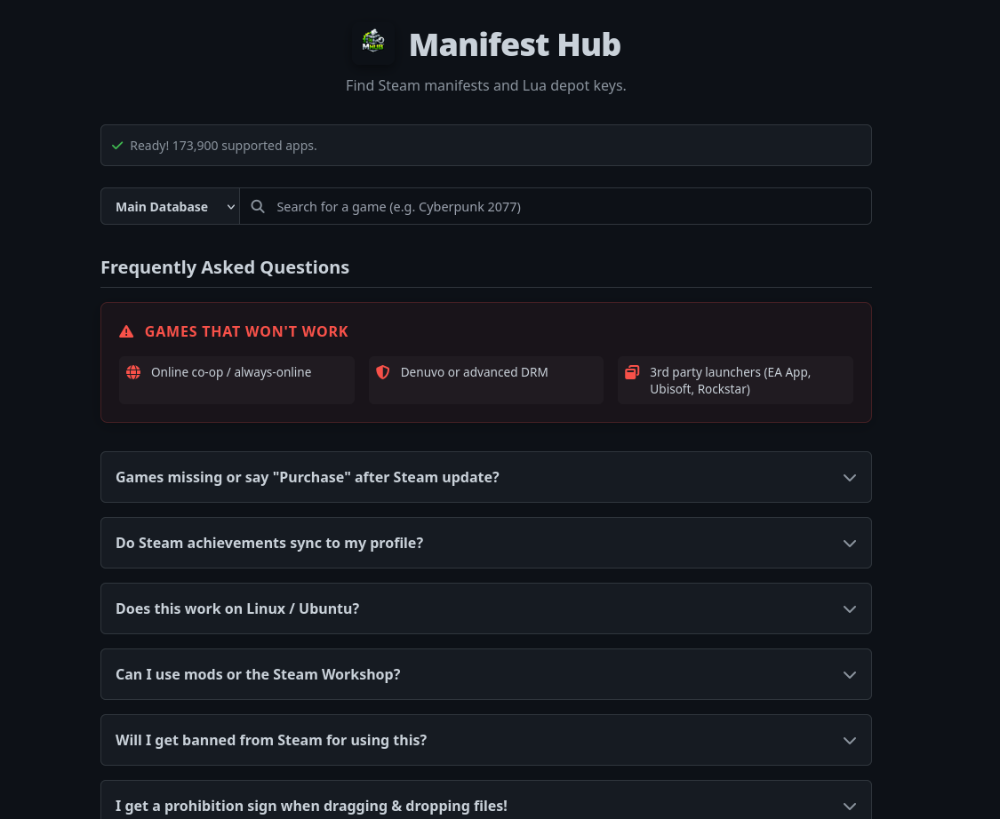
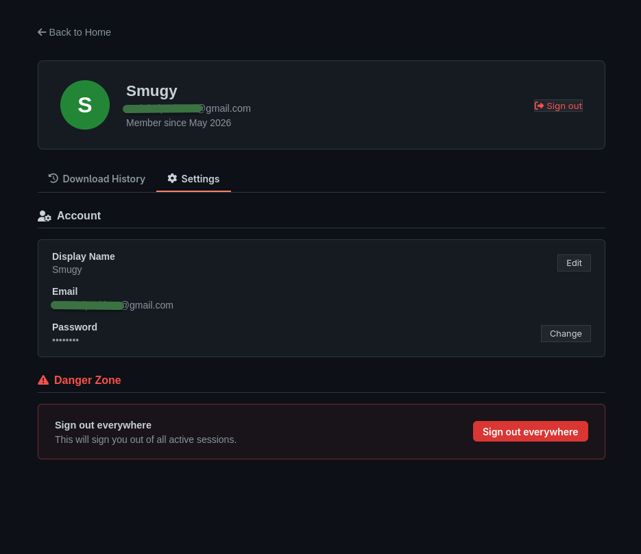

# Manifest Hub

A web application for searching, viewing, and downloading Steam manifests.

## About

Manifest Hub allows users to search through game manifests, view manifest details, and download manifest archives sourced from GitHub repositories. It features user accounts, download history tracking, and a responsive design.

## Screenshots

Click to expand screenshots

## Usage

1. Visit the [Manifest Hub website](https://manifesthub.trionine.xyz).
2. Search for a game by name or AppID.
3. Browse the listed manifest files and Lua depot keys.
4. Click **Download** on any file, or **Download All** to get everything at once.

You can also use the **Legacy Archive** mode to look up a specific AppID directly.

## Data Sources

The platform aggregates data from multiple external sources to serve files dynamically:

- **[jsnli/steamappidlist](https://github.com/jsnli/steamappidlist)**: Provides the main database mapping game names to Steam AppIDs.
- **[api.steamcmd.net](https://api.steamcmd.net/)**: Queried dynamically to find the latest live `manifestId` for a game's depots.
- **[fylsdy/ManifestHub](https://github.com/fylsdy/ManifestHub)**: Hosts `depotkeys.json`, which is used to dynamically generate the `.lua` configuration files locally in your browser.
- **[qwe213312/k25FCdfEOoEJ42S6](https://github.com/qwe213312/k25FCdfEOoEJ42S6)**: A massive repository hosting the actual live `.manifest` files that are downloaded.
- **[SSMGAlt/ManifestHub2](https://github.com/SSMGAlt/ManifestHub2)**: The legacy archive, where older static backups (ZIPs of manifests and lua files) are stored in branches named by AppID.

## Credits

- **Developer:** [TRIONINE](https://trionine.xyz)

## License

This project is licensed under the [MIT License](LICENSE).

---

This project is not affiliated with Valve or Steam.