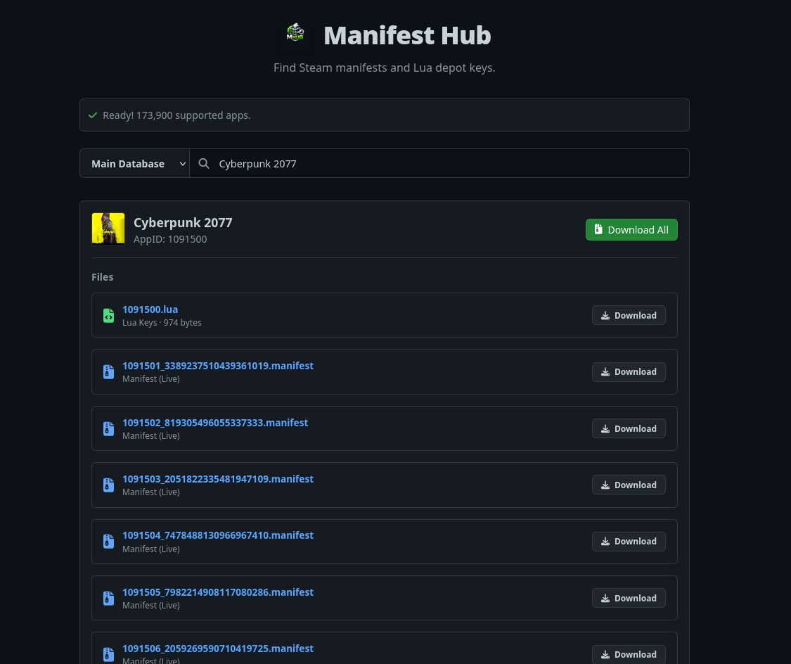
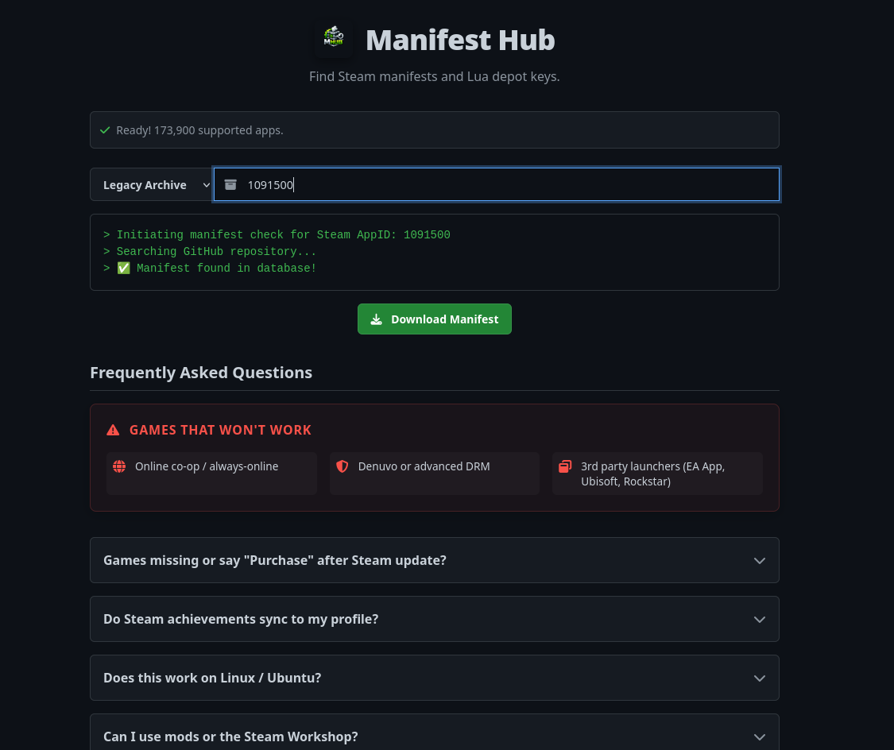
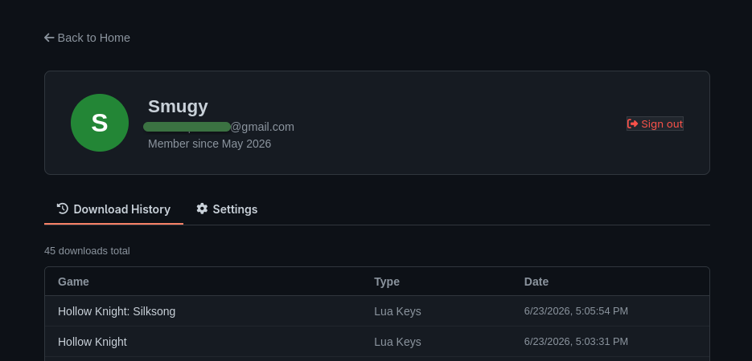

# Manifest Hub

A web application for searching, viewing, and downloading Steam manifests.

## About

Manifest Hub allows users to search through game manifests, view manifest details, and download manifest archives sourced from GitHub repositories. It features user accounts, download history tracking, and a responsive design.

## Screenshots

<details>
<summary>Click to expand screenshots</summary>








</details>

## Usage

1. Visit the [Manifest Hub website](https://manifesthub.trionine.xyz).
2. Search for a game by name or AppID.
3. Browse the listed manifest files and Lua depot keys.
4. Click **Download** on any file, or **Download All** to get everything at once.

You can also use the **Legacy Archive** mode to look up a specific AppID directly.

## Project Structure

The project is organized cleanly into the following folders and files:

```text
ManifestHub/
├── .github/workflows/
│   └── update-trending.yml    # Daily GitHub Action to fetch trending downloads
├── assets/
│   ├── manifesthub.png        # Brand assets & logos
│   ├── mhub.png
│   └── screenshots/           # Reorganized documentation screenshots
├── backend/
│   ├── cloudflare-worker.js   # Cloudflare Worker bridge source code
│   ├── manifesthub-record.gs  # Google Apps Script database trigger backup
│   ├── supabase.sql           # Database schema & policies for Supabase
│   └── backend.md             # Backend architecture documentation
├── css/
│   ├── base.css               # Global reset, typography, colors, buttons & inputs
│   ├── components.css         # Modals, search results, file items, FAQ, auth modal, sidebar
│   ├── error.css              # Custom styling for the 404 page
│   ├── layout.css             # Layout utilities, footer, media queries, profile/auth forms
│   └── profile-styles.css     # User profile page specific styling
├── data/
│   ├── faq.js                 # Frequently Asked Questions native JS data array
│   └── trending-data.json     # Cached daily trending downloads statistics
├── extras/
│   ├── maindatabase.html      # Legacy database search view
│   ├── oglegacy.html          # Original legacy app design fallback
│   └── split_bloated_data.py  # Python utility for splitting large databases
├── js/
│   ├── config.js              # Supabase API credentials configuration
│   ├── utils.js               # Shared helper functions (e.g. resending confirmation mail)
│   ├── presence.js            # Realtime online presence tracking
│   ├── auth.js                # Authentication UI, forms, and session listeners
│   ├── database.js            # Depot keys/App lists fetching and mapping builder
│   ├── search.js              # Search indexing, download handlers, ZIP generator
│   ├── trending.js            # Popular files rendering and announcements carousel
│   ├── poll.js                # Active community voting poll widget
│   ├── faq.js                 # FAQ interactive accordion rendering
│   ├── profile.js             # Profile history dashboard, settings, and cache management
│   └── main.js                # Shared namespace initializer & orchestrator
├── scripts/
│   └── update-trending.js     # Fetches trending data from Google Sheets API
├── _headers                   # Netlify custom HTTP headers (Cache-Control)
├── _redirects                 # Netlify clean URLs redirect mapping
├── 404.html                   # 404 error page (Lost Like Zoro)
├── index.html                 # Main Search Engine & FAQ UI
└── profile.html               # User Profile & Download History UI
```

## Data Sources

The platform aggregates data from multiple external sources to serve files dynamically:

- **[jsnli/steamappidlist](https://github.com/jsnli/steamappidlist)**: Provides the main database mapping game names to Steam AppIDs.
- **[api.steamcmd.net](https://api.steamcmd.net/)**: Queried dynamically to find the latest live `manifestId` for a game's depots.
- **[fylsdy/ManifestHub](https://github.com/fylsdy/ManifestHub)**: Hosts `depotkeys.json`, which is used to dynamically generate the `.lua` configuration files locally in your browser.
- **[qwe213312/k25FCdfEOoEJ42S6](https://github.com/qwe213312/k25FCdfEOoEJ42S6)**: A massive repository hosting the actual live `.manifest` files that are downloaded.
- **[SSMGAlt/ManifestHub2](https://github.com/SSMGAlt/ManifestHub2)**: The legacy archive, where older static backups (ZIPs of manifests and lua files) are stored in branches named by AppID.

## Credits

- **Developer:** [TRIONINE](https://trionine.xyz)

## License

This project is licensed under the [MIT License](LICENSE).

---

This project is not affiliated with Valve or Steam.